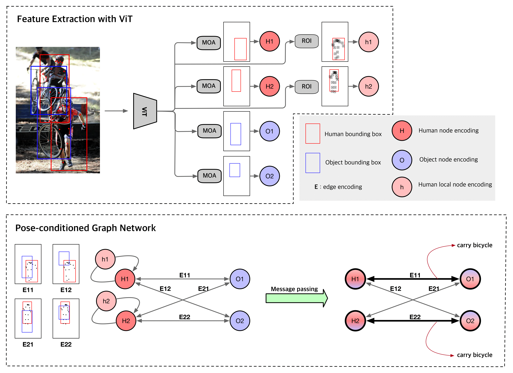

## [CVPR 2023] ViPLO - Official PyTorch implementation



[](https://paperswithcode.com/sota/human-object-interaction-detection-on-hico?p=viplo-vision-transformer-based-pose)

**ViPLO: Vision Transformer based Pose-Conditioned Self-Loop Graph for Human-Object Interaction Detection**<br>
Jeeseung Park, Jin-Woo Park, Jong-Seok Lee<br>
https://arxiv.org/abs/2304.08114<br>

Abstract: *Human-Object Interaction (HOI) detection, which localizes and infers relationships between human and objects, plays an important role in scene understanding. Although two-stage HOI detectors have advantages of high efficiency in training and inference, they suffer from lower performance than one-stage methods due to the old backbone networks and the lack of considerations for the HOI perception process of humans in the interaction classifiers. In this paper, we propose Vision Transformer based Pose-Conditioned Self-Loop Graph (ViPLO) to resolve these problems. First, we propose a novel feature extraction method suitable for the Vision Transformer backbone, called masking with overlapped area (MOA) module. The MOA module utilizes the overlapped area between each patch and the given region in the attention function, which addresses the quantization problem when using the Vision Transformer backbone. In addition, we design a graph with a pose-conditioned self-loop structure, which updates the human node encoding with local features of human joints. This allows the classifier to focus on specific human joints to effectively identify the type of interaction, which is motivated by the human perception process for HOI. As a result, ViPLO achieves the state-of-the-art results on two public benchmarks, especially obtaining a +2.07 mAP performance gain on the HICO-DET dataset.*

## Requirements

* We have done all testing and development using 4 RTX 3090 GPUs with 24GB.
* We recommend using Docker, with nvcr.io/nvidia/pytorch:21.06-py3 Image file. Please refer to [NVIDIA docs](https://catalog.ngc.nvidia.com/orgs/nvidia/containers/pytorch) for more detail. 
* Additional python libraries: `pip instal gdown einops ujson timm munkres`. 

## Installation

**Step 1**: Download the repository and its' submodules. `git clone https://github.com/Jeeseung-Park/ViPLO`, `git submodule update --init --recursive ? `

**Step 2**: Install the CLIP with our MOA module added via `pip install ./CLIP`

**Step 3**: Install the lightweight deep learning library [Pocket](https://github.com/fredzzhang/pocket)


## Preparing datasets (HICO-DET)

**Step 1**: Download the HICO-DET dataset. 
```.bash
bash hicodet/download.sh 
```
If the above script does not work, you can download from [Google Drive](https://drive.google.com/open?id=1QZcJmGVlF9f4h-XLWe9Gkmnmj2z1gSnk), then unpack the tarball (hico_20160224_det.tar.gz) under the 'hicodet' folder. (ex. `./hicodet/hico_20160224_det/images/test2015/...`)


**Step 2**: Run a Faster R-CNN pre-trained on MS COCO to generate detections & Generate ground truth detections for test. 
```.bash
python hicodet/detections/preprocessing.py --partition train2015
python hicodet/detections/preprocessing.py --partition test2015
python hicodet/detections/generate_gt_detections.py --partition test2015 

```

**Step 3**: For generating fine-tuned detections and human pose (keypoints), we recommend just downloading pre-inferenced detection/keypoint proposals with the script below. Then **you can skip Steps 4 and 5**, which can take a long time. 
```.bash
bash download/download_det_pose.sh
```

**Step 4**: Generate fine-tuned detections for test2015 from DETR-based detector [UPT](https://github.com/fredzzhang/upt). 
```.bash
bash download/download_upt_weight.sh 
python upt/upt_generate_detection_hicodet.py --pretrained upt/checkpoints/detr-r101-dc5-hicodet.pth --backbone resnet101 --dilation
```

**Step 5**: Estimate the human pose for detection and GT annotation, using off-the-shelf pose estimator [ViTPose](https://github.com/ViTAE-Transformer/ViTPose). 
```.bash
# Weight from official vitpose github
bash download/download_vitpose_weight.sh 
# Estimate human pose for detections. 
python ViTPose/hicodet_detection_vitpose.py --image_dir hicodet/hico_20160224_det/images/train2015 --det_json_dir hicodet/detections/train2015 --det_save_json_dir hicodet/detections/train2015_vitpose 
python ViTPose/hicodet_detection_vitpose.py --image_dir hicodet/hico_20160224_det/images/test2015 --det_json_dir hicodet/detections/test2015 --det_save_json_dir hicodet/detections/test2015_vitpose
python ViTPose/hicodet_detection_vitpose.py --image_dir hicodet/hico_20160224_det/images/test2015 --det_json_dir hicodet/detections/test2015_upt --det_save_json_dir hicodet/detections/test2015_upt_vitpose
python ViTPose/hicodet_detection_vitpose.py --image_dir hicodet/hico_20160224_det/images/test2015 --det_json_dir hicodet/detections/test2015_gt --det_save_json_dir hicodet/detections/test2015_gt_vitpose
# Estimate human pose for GT annotations. 
python ViTPose/hicodet_instance_vitpose.py --image_dir hicodet/hico_20160224_det/images/train2015 --gt_json_path hicodet/instances_train2015.json --gt_save_json_path hicodet/instances_train2015_vitpose.json 
python ViTPose/hicodet_instance_vitpose.py --image_dir hicodet/hico_20160224_det/images/test2015 --gt_json_path hicodet/instances_test2015.json --gt_save_json_path hicodet/instances_test2015_vitpose.json
```


## Evaluation (HICO-DET)

You can evaluate pretrained model (VIPLO large) on HICO-DET with the following commands:

```.bash
# Download pretrained model weight, VIPLO large.
bash download/download_checkpoint.sh
# Evaluate on fine-tuned detections
python test.py --detection-dir hicodet/detections/test2015_upt_vitpose --model-path checkpoints/best_hicodet.pt 
# Evaluate on GT detections
python test.py --detection-dir hicodet/detections/test2015_gt_vitpose --model-path checkpoints/best_hicodet.pt 
```

| Detections         | Full (D) |Rare (D)|Non-rare (D)|Full(KO)|Rare (KO)|Non-rare (KO)|
|:-------------------|:--------:| :---: | :---: | :---: |:-------:|:-----------:| 
| Fine-tuned detections   |  37.22   | 35.45 |37.75 | 40.61|  38.82  |    41.15    | [
| GT detections |  62.09   | 59.26|  62.93|  -   |   -  |  -  | 

D: Default, KO: Known object

## Training new networks (HICO-DET)


In its most basic form, training new networks boils down to:

```.bash
# Training the small version of VIPLO
python main.py --cache-dir ~/checkpoints/hicodet_train --world-size 4 --batch-size 32 --patch-size 32 
```

Additional command line options allow you to train a customized model:

* `--patch-size` You can select between 16 (default) and 32, which leads to training the large and small version of VIPLO, respectively. We set the batch size to 24 when training VIPLO large, due to the OOM. 
* `--poseoff` With this command line, pose information will not be used for training. 
* `--backbone-name` You can select between 'CLIP' and 'CLIP_CLS' (default), and with 'CLIP' backbone, MOA module will not be used for training (Not recommended). 


## Citation
If you found our work useful, please don't forget to cite
```
@misc{park2023viplo,
      title={ViPLO: Vision Transformer based Pose-Conditioned Self-Loop Graph for Human-Object Interaction Detection}, 
      author={Jeeseung Park and Jin-Woo Park and Jong-Seok Lee},
      year={2023},
      eprint={2304.08114},
      archivePrefix={arXiv},
      primaryClass={cs.CV}
}
```


The code is heavily based on the [spatially-conditioned-graphs implementation](https://github.com/fredzzhang/spatially-conditioned-graphs)
